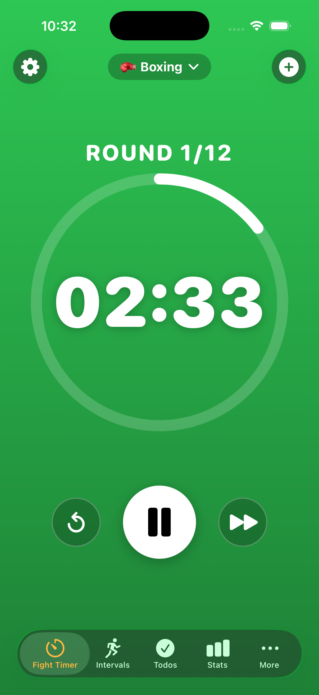
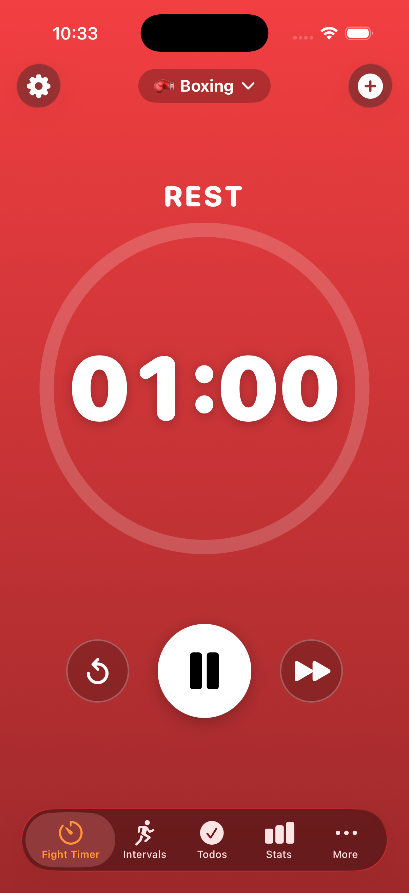
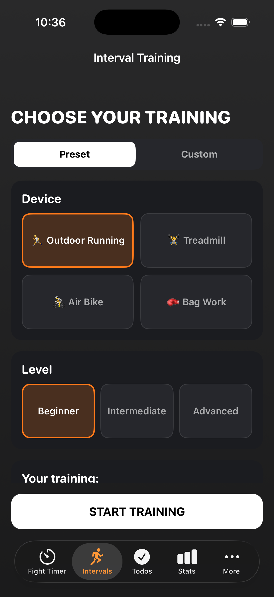
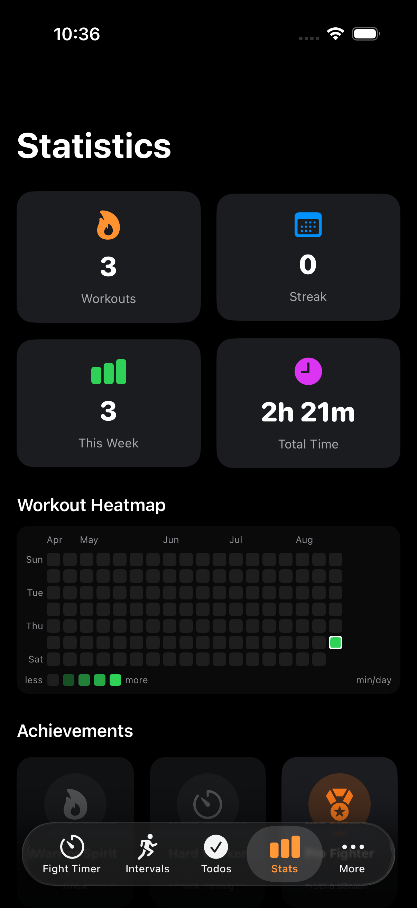
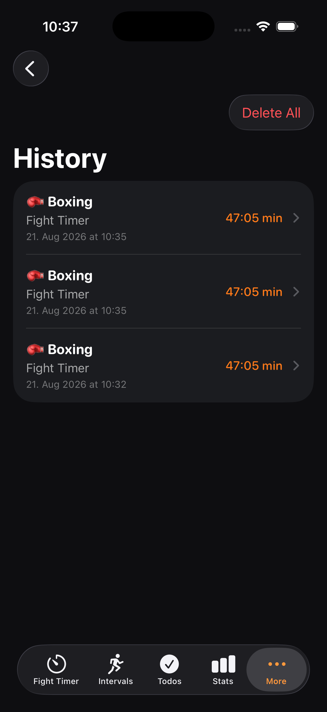
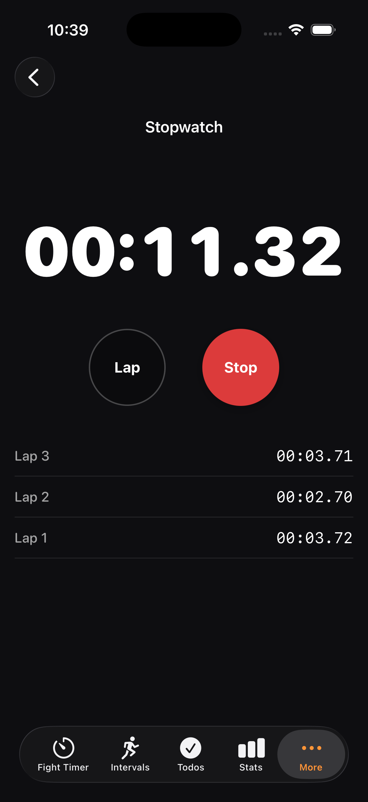

# Boxing Interval Timer — iOS

A professional combat-sports interval timer for iPhone and iPad — **live on the App Store**. Built from scratch in SwiftUI with a focus on a fast, glanceable timer, offline-first data, and full localization.

[](https://apps.apple.com/app/id6759615674)


> A cross-platform **Android/Flutter port** of this app lives in a separate repo: **[boxing-timer-flutter](https://github.com/mr-dzzs21/boxing-timer-flutter)** — same design and feature set, rebuilt in Dart/Flutter.

## Screenshots

<p align="center">
  
  
  
</p>
<p align="center">
  
  
  
</p>
<p align="center"><sub>Fight timer (round / rest — the background follows the phase) · interval setup · statistics · history · stopwatch</sub></p>

## Features

- **Fight Timer** — round/rest timer with presets for **Boxing, MMA, K1, Muay Thai, BJJ, Judo, Wrestling, and Taekwondo**, plus custom profiles you can create and save.
- **Interval Training** — configurable work/rest HIIT timers for outdoor running, treadmill, air bike, and bag work, each with beginner / intermediate / advanced levels.
- **Stopwatch** with laps.
- **Workout History & Statistics** — every session is stored locally; view streaks, total training time, favourite sport, and weekly progress.
- **Todo list** with usage-aware reminder scheduling.
- **Live Activity** — the running timer stays visible on the Lock Screen and in the Dynamic Island.
- **Background-safe timing** — remaining time is derived from wall-clock time, so the timer stays accurate across backgrounding, screen lock, and app suspension.
- **Audio & haptics** — a round bell and a 10-second warning that duck (don't stop) background music and play even in silent mode.
- **7 languages** — English, German, Spanish, French, Russian, Portuguese, and Arabic with full right-to-left layout.
- **Private by design** — no accounts, no servers, no analytics, no ads. Everything stays on the device.

## Tech Stack

| Area | Technology |
|------|-----------|
| UI | SwiftUI |
| Architecture | MVVM (`ObservableObject` view models, `@Published` state) |
| Persistence | Core Data (workout history) · `UserDefaults` (settings & profiles) |
| Purchases | StoreKit 2 (optional tip jar) |
| Widgets | WidgetKit + ActivityKit (Live Activity / Dynamic Island) |
| Audio & haptics | AVFoundation (`.mixWithOthers` / `.duckOthers`) · Core Haptics |
| Notifications | UserNotifications |
| Localization | Custom `LanguageManager` — 7 languages incl. RTL |

## Architecture

- **Drift-free timer core.** The current phase (warm-up → round → rest → done) and the seconds remaining are computed from a start timestamp instead of a ticking counter. The timer therefore survives backgrounding, lock, and process suspension without accumulating error.
- **MVVM.** `FightTimerViewModel` / `IntervalTimerViewModel` own the timer state and its side effects (sound, haptics, Live Activity updates); SwiftUI views simply observe them.
- **Design system.** A single source of truth for colours, type scale, spacing, and components drives the dark "bold/athletic" look. The timer background follows the phase — green while a round runs, red during rest.
- **Localization first.** Every user-facing string goes through `LanguageManager`; selecting Arabic flips the entire layout to right-to-left.

## Build & Run

Requirements: **Xcode 15+**, **iOS 16.6+**.

```bash
open "Boxing timer.xcodeproj"

# …or from the command line:
xcodebuild -project "Boxing timer.xcodeproj" -scheme "Boxing timer" \
  -destination "platform=iOS Simulator,name=iPhone 16" build
```

Targets: the main **Boxing timer** app, a **BoxingTimerWidgetExtension** (Live Activity), and a UI-test suite.

## Privacy

The app collects no personal data, sends nothing to any server, and contains no trackers or ads — all data stays on your device.
[Privacy Policy →](https://mr-dzzs21.github.io/Box-Interval-Timer/privacy-policy.html)

## License

© 2026 Diyar Kaymaz. All rights reserved. See [LICENSE](LICENSE).
The source is published for portfolio and review purposes; it is not licensed for redistribution, resale, or republishing.

## Contact

box.timer.app@gmail.com
